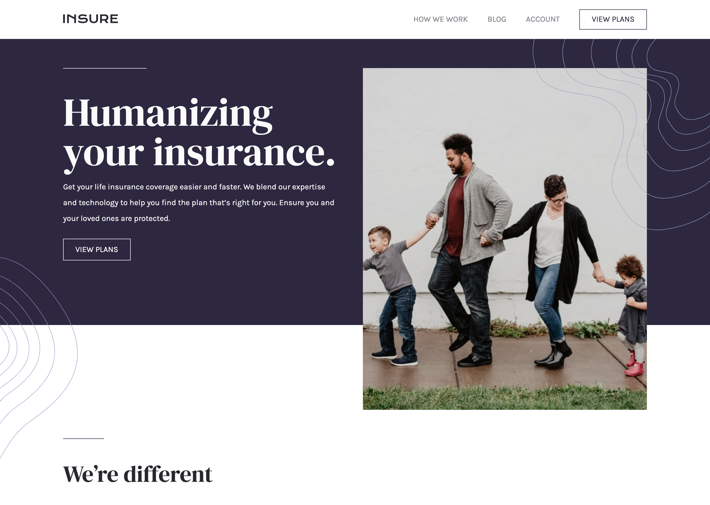
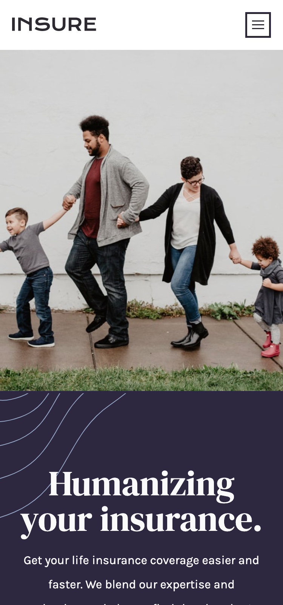

# Insure landing page

  
  
  

## Overview

_An accessible and responsive landing page for an insurance service._

 

## Links

<a href="https://github.com/AngeliqueDF/insure-landing-page">GitHub repo</a> • <a href="/.github/CONTRIBUTING.md">Live demo </a>

 

## How to run the project

1. `git clone HTTPS_REPO_URL MY-FOLDER-NAME`
2. `cd MY-FOLDER-NAME`
3. `npm install`
4. `npm run dev`
5. visit `http://localhost:3000`

 

## Features

- Responsive
- Accessible
- Mobile menu toggling

## Technologies

- HTML5
- CSS3
- Vite.js

 

## Description

This is my implementation of the Insure landing page challenge on Frontend Mentor.

> Users should be able to:
>
> - View the optimal layout for the site depending >on their device's screen size
> - See hover states for all interactive elements on the page
>   -- [Frontend Mentor](https://www.frontendmentor.io/challenges/insure-landing-page-uTU68JV8)

 

### How I built this project

The landing page is implemented following a mobile-first approach.

#### The HTML

I started by structuring the page with semantic and accessible HTML.

#### Working on the CSS: matching the design

This project includes wavy decorative patterns and a hero image. Some of these elements overflowing their parent element, others being contained within them. Added to that, their visibility changes according to the viewport's size.

Hence depending on the element and the screen width, I either added the images directly in HTML or through CSS.

This allowed me to reduce the amount of JavaScript needed to complete the project.

#### Minimal JavaScript

The JavaScript toggles the `.mobile-menu-open` class on mobile.

<!-- ### Recommended technologies and tools -->

 

## Status

### Planned changes

- [ ] Improve accessibility.
- [ ] Improve SEO.

[See the advancement of the project here. PRs welcome!]()

## Sources

- [Insure landing page on Frontend Mentor](https://www.frontendmentor.io/challenges/insure-landing-page-uTU68JV8)

## Author

- [@AngeliqueDF on GitHub.](https://github.com/AngeliqueDF)
- [Visit my website.](https://adf.dev)
- [View my Frontend Mentor profile.](https://www.frontendmentor.io/profile/AngeliqueDF)
